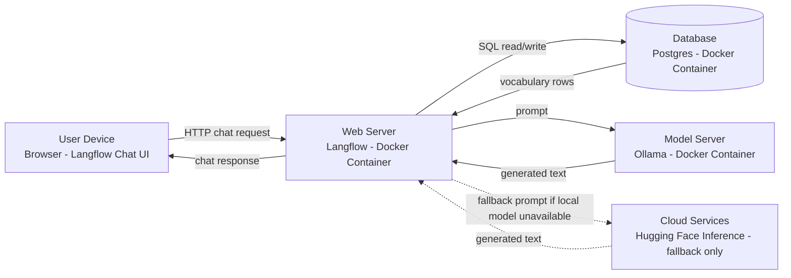

# System Architecture / Deployment Diagram — Language Tutor with Langflow

**Notes**
- All four boxes besides Cloud Services run locally via the same Docker Compose stack (Story 1 + Story 1b in `OVERVIEW.md`) — nothing here requires external hosting.
- The Cloud Services box is dashed/optional: it's only exercised if local hardware can't run the Ollama model, per Story 1b's fallback plan.
