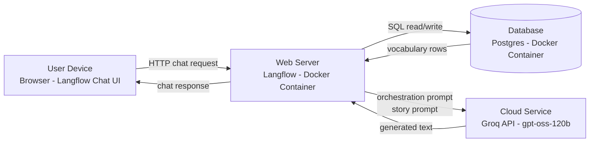

# System Architecture / Deployment Diagram — Language Tutor with Langflow

```mermaid
flowchart LR
    UD[User Device<br/>Browser - Langflow Chat UI]
    WS[Web Server<br/>Langflow - Docker Container]
    DB[(Database<br/>Postgres - Docker Container)]
    GQ[Cloud Service<br/>Groq API - gpt-oss-120b]

    UD -- HTTP chat request --> WS
    WS -- SQL read/write --> DB
    DB -- vocabulary rows --> WS
    WS -- "orchestration prompt<br/>story prompt" --> GQ
    GQ -- generated text --> WS
    WS -- chat response --> UD
```

**Notes**
- Langflow and Postgres run locally via the same Docker Compose stack (Story 1 in
  `OVERVIEW.md`). The only external dependency is the Groq API (free tier), reached over HTTPS
  with `GROQ_API_KEY` from `.env` (Story 1b).
- The original design used a local Ollama container with a Hugging Face Inference fallback. That
  was dropped because local hardware couldn't run the model; there is currently no automatic
  provider fallback (see the Bonus Challenge in `IMPLEMENTATION-GUIDE.md`).
- Two kinds of Groq calls exist: Langflow's Agent node calls Groq through the custom
  `GroqLanguageModel` component (orchestrator, `gpt-oss-120b`), and `story_tool.py` calls Groq
  directly via `urllib` (story generation, `gpt-oss-120b`). Groq's free-tier rate limit is shared
  across both.
