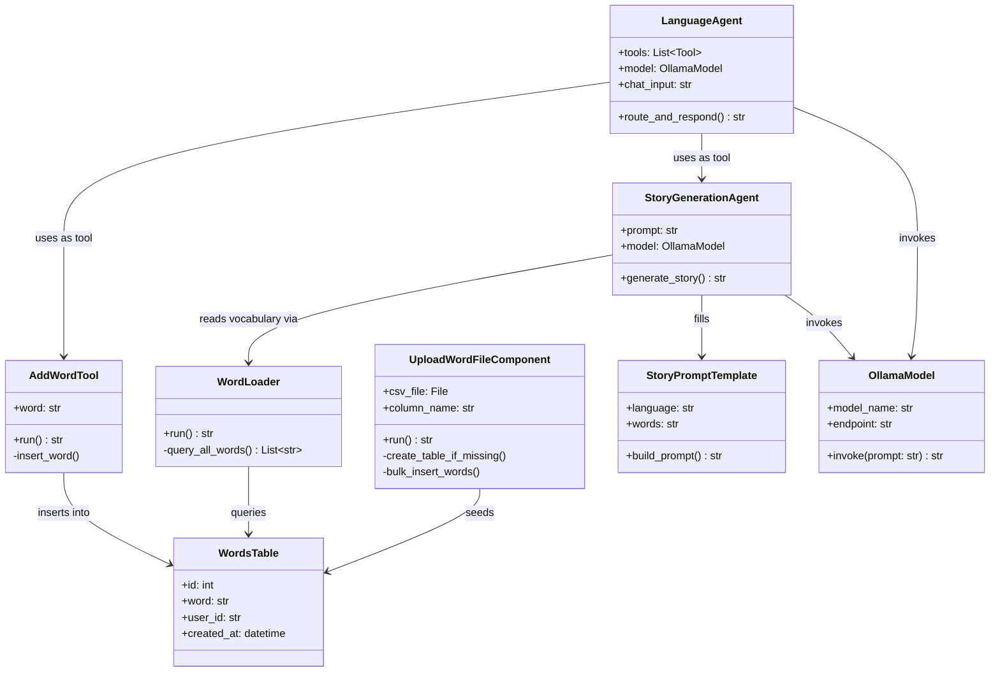

# Rough Class Diagram — Language Tutor with Langflow

**Notes**
- "Rough" by design — this mirrors the 9 components from `OVERVIEW.md` section 4, not a full implementation-ready class model.
- `OllamaModel` stands in for whichever model component is active (Ollama primary, Hugging Face Inference fallback) — swap the class name/attributes if you standardize on the fallback instead.
