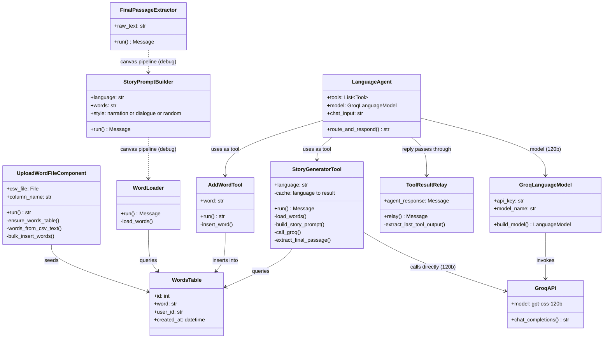

# Rough Class Diagram — Language Tutor with Langflow

```mermaid
classDiagram
    class UploadWordFileComponent {
        +csv_file: File
        +column_name: str
        +run() str
        -ensure_words_table()
        -words_from_csv_text()
        -bulk_insert_words()
    }

    class AddWordTool {
        +word: str
        +run() str
        -insert_word()
    }

    class StoryGeneratorTool {
        +language: str
        +run() Message
        -load_words()
        -build_story_prompt()
        -call_groq()
        -extract_final_passage()
        -cache: language to result
    }

    class WordLoader {
        +run() Message
        -load_words()
    }

    class StoryPromptBuilder {
        +language: str
        +words: str
        +style: narration or dialogue or random
        +run() Message
    }

    class FinalPassageExtractor {
        +raw_text: str
        +run() Message
    }

    class LanguageAgent {
        +tools: List~Tool~
        +model: GroqLanguageModel
        +chat_input: str
        +route_and_respond() str
    }

    class ToolResultRelay {
        +agent_response: Message
        +relay() Message
        -extract_last_tool_output()
    }

    class GroqLanguageModel {
        +api_key: str
        +model_name: str
        +build_model() LanguageModel
    }

    class GroqAPI {
        +model: gpt-oss-120b
        +chat_completions() str
    }

    class WordsTable {
        +id: int
        +word: str
        +user_id: str
        +created_at: datetime
    }

    LanguageAgent --> AddWordTool : uses as tool
    LanguageAgent --> StoryGeneratorTool : uses as tool
    LanguageAgent --> GroqLanguageModel : model (120b)
    LanguageAgent --> ToolResultRelay : reply passes through
    GroqLanguageModel --> GroqAPI : invokes
    StoryGeneratorTool --> GroqAPI : calls directly (120b)
    StoryGeneratorTool --> WordsTable : queries
    AddWordTool --> WordsTable : inserts into
    WordLoader --> WordsTable : queries
    UploadWordFileComponent --> WordsTable : seeds
    StoryPromptBuilder ..> WordLoader : canvas pipeline (debug)
    FinalPassageExtractor ..> StoryPromptBuilder : canvas pipeline (debug)
```

**Notes**
- "Rough" by design — not a full implementation-ready class model.
- `StoryGeneratorTool` consolidates the logic of `WordLoader`, `StoryPromptBuilder`,
  `story_guard.py`, and `FinalPassageExtractor`, because Langflow's Tool Mode returns only a
  component's own output. The dotted arrows show the standalone Step 8 canvas pipeline, which is
  kept for manual debugging and is not what the Language Agent calls.
