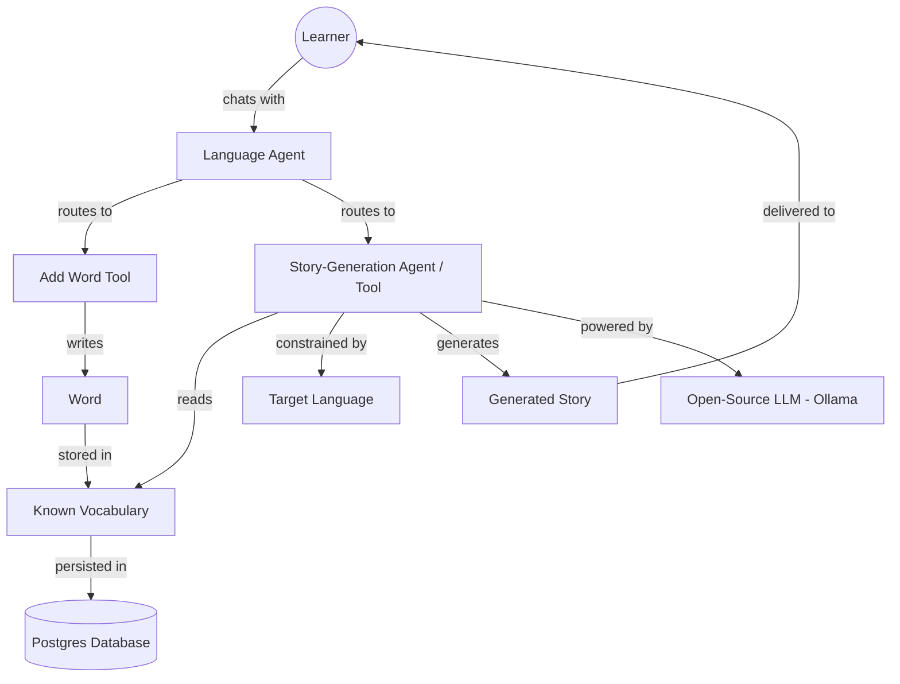

# High-Level Concept Map — Language Tutor with Langflow

**Notes**
- This is a concept-level view (not a component/class view) — it shows how the *ideas* of learner, vocabulary, language, story, and model relate to each other, independent of implementation details.
- The recurring theme: the *Vocabulary* concept is the shared constraint that both the "add word" and "generate story" paths revolve around.
