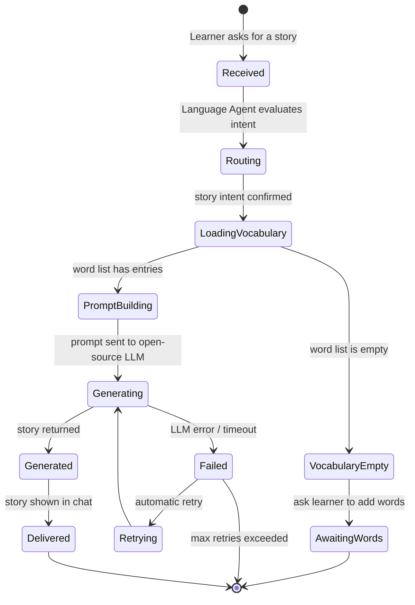

# State Diagram — Story Request Lifecycle

**Notes**
- Chosen over the "Word" entity because a story request has the most non-trivial lifecycle in this project (branching on empty vocabulary, and a generation-failure/retry path that's more likely with a smaller open-source model than with a hosted frontier model).
- `Failed → Retrying → Generating` is worth implementing explicitly, since open-source models served locally are more prone to malformed or empty completions than GPT-4.1.
