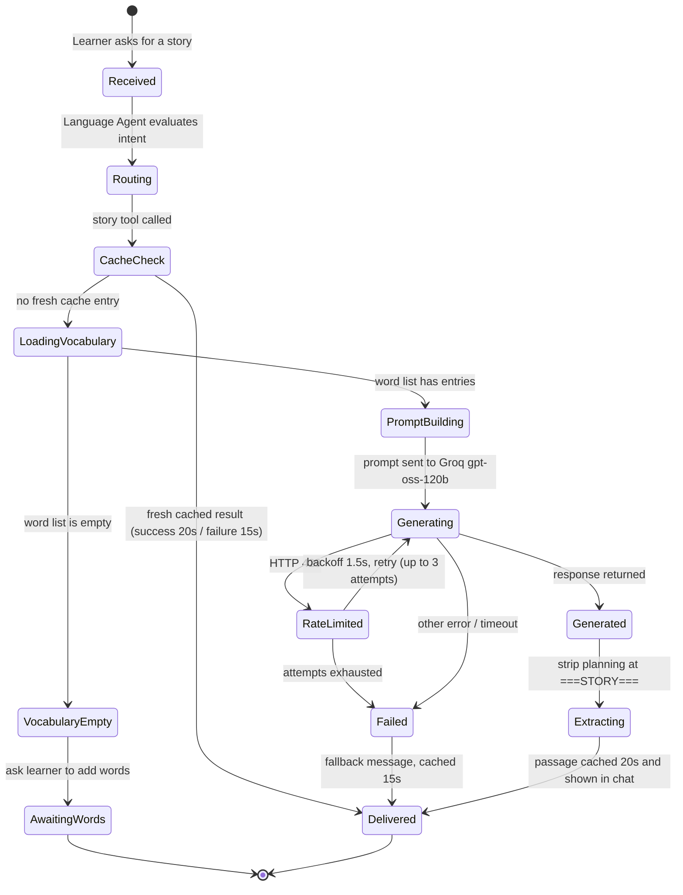

# State Diagram — Story Request Lifecycle

```mermaid
stateDiagram-v2
    [*] --> Received: Learner asks for a story
    Received --> Routing: Language Agent evaluates intent
    Routing --> CacheCheck: story tool called
    CacheCheck --> Delivered: fresh cached result (success 20s / failure 15s)
    CacheCheck --> LoadingVocabulary: no fresh cache entry
    LoadingVocabulary --> VocabularyEmpty: word list is empty
    LoadingVocabulary --> PromptBuilding: word list has entries
    VocabularyEmpty --> AwaitingWords: ask learner to add words
    AwaitingWords --> [*]
    PromptBuilding --> Generating: prompt sent to Groq gpt-oss-120b
    Generating --> Generated: response returned
    Generating --> RateLimited: HTTP 429
    RateLimited --> Generating: backoff 1.5s, retry (up to 3 attempts)
    RateLimited --> Failed: attempts exhausted
    Generating --> Failed: other error / timeout
    Failed --> Delivered: fallback message, cached 15s
    Generated --> Extracting: strip planning at ===STORY===
    Extracting --> Delivered: passage cached 20s and shown in chat
    Delivered --> [*]
```

**Notes**
- Chosen over the "Word" entity because a story request has the most non-trivial lifecycle in this project (cache hit, empty-vocabulary branch, rate-limit retry, failure fallback).
- The retry, caching, and failure handling are implemented in `story_tool.py` (`call_groq`, `generate_story_for_learner`) and tested in `tests/test_call_groq_retry.py` and `tests/test_story_tool.py`.
- Failures are cached briefly so that an Agent calling the tool several times in one turn during a rate-limit burst doesn't re-run the full retry loop on every call.
- Non-429 errors are not retried.
