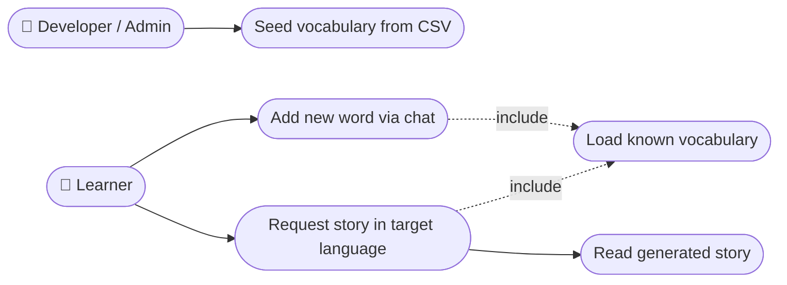

# Use Case Diagram — Language Tutor with Langflow

**Notes**
- *Learner* is the day-to-day actor, interacting entirely through chat.
- *Developer / Admin* is a separate actor for the one-off CSV seeding step (Story 2), which isn't exposed through the chat agent.
- "Load known vocabulary" is modeled as an `<<include>>` use case since both "Add new word" (to check for duplicates) and "Request story" depend on it.
