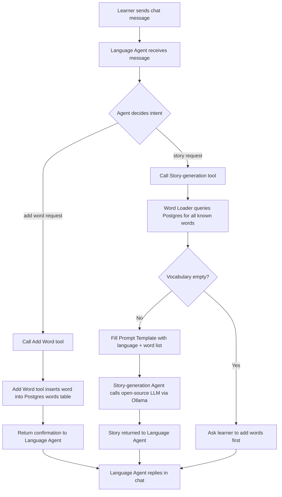

# Workflow Diagram — Language Tutor with Langflow

**Notes**
- This traces one full round-trip of a chat message, matching Stories 3, 4, 5, and 6 from `OVERVIEW.md`.
- The `E2` branch is the "vocabulary empty" guard called out explicitly in Story 5's acceptance criteria.
