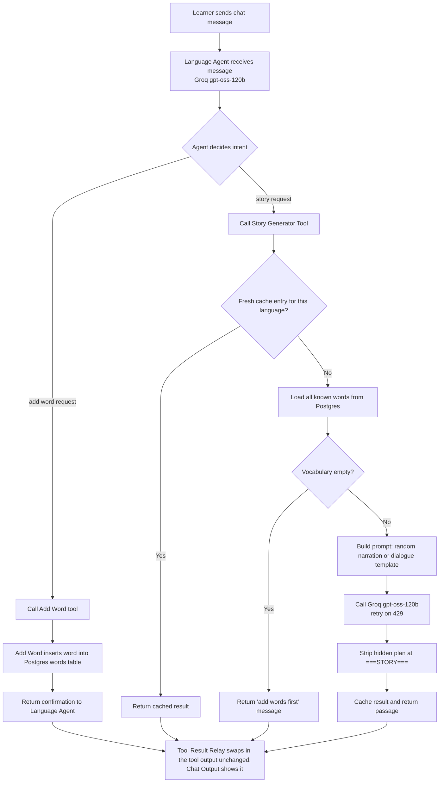

# Workflow Diagram — Language Tutor with Langflow

```mermaid
flowchart TD
    A[Learner sends chat message] --> B[Language Agent receives message<br/>Groq gpt-oss-120b]
    B --> C{Agent decides intent}

    C -->|"add word" request| D[Call Add Word tool]
    C -->|"story" request| E[Call Story Generator Tool]

    D --> D1[Add Word inserts word into Postgres words table]
    D1 --> D2[Return confirmation to Language Agent]
    D2 --> Z[Tool Result Relay swaps in the tool output unchanged,<br/>Chat Output shows it]

    E --> E0{Fresh cache entry for this language?}
    E0 -->|Yes| E7[Return cached result]
    E0 -->|No| E1[Load all known words from Postgres]
    E1 --> E2{Vocabulary empty?}
    E2 -->|Yes| E3[Return 'add words first' message]
    E2 -->|No| E4[Build prompt: random narration or dialogue template]
    E4 --> E5[Call Groq gpt-oss-120b<br/>retry on 429]
    E5 --> E6[Strip hidden plan at ===STORY===]
    E6 --> E8[Cache result and return passage]
    E7 --> Z
    E3 --> Z
    E8 --> Z
```

**Notes**
- This traces one full round-trip of a chat message, matching Stories 3, 4, 5, and 6 from `OVERVIEW.md`.
- Everything inside the `E` branch runs inside one component (`story_tool.py`), because Langflow's Tool Mode returns only the tool's own output.
- The `E2` branch is the "vocabulary empty" guard called out in Story 5's acceptance criteria.
- Step 9 fix: the Agent sometimes shortened or reworded the tool's result. The Tool Result Relay (`tool_result_relay.py`) now replaces the Agent's reply with the tool's exact output at node Z; without a tool call, the Agent's own text passes through. See `CHANGELOG.md`.
